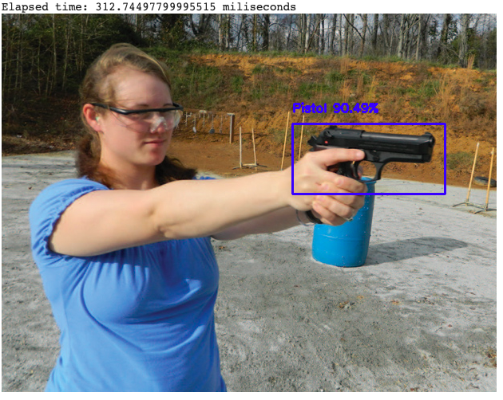

# End-to-end-Gun-Detection-in-TFLite-and-opencv

                                                    
                                          
This repository shows how to perform guns detector model training with the TFOD API (TF1), optimize it with TFLite, and perform inference with the optimized model
# About Notebooks
  - training.ipynb: Shows how to train a custom object detection model on the gun dataset (non-eager mode).
  - inference.ipynb: Shows how to optimize exported graph with TFLite, and run inference.

